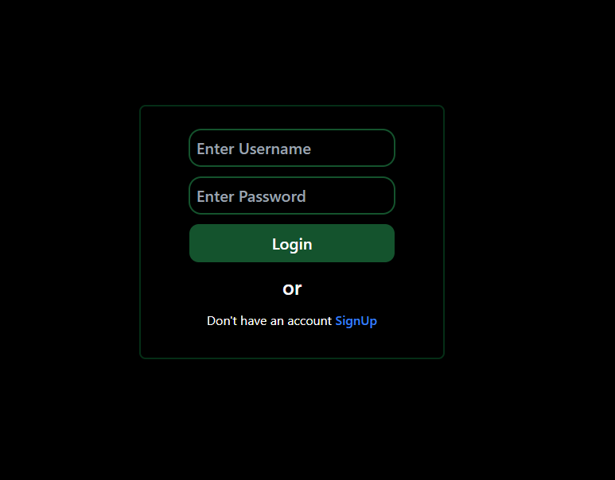
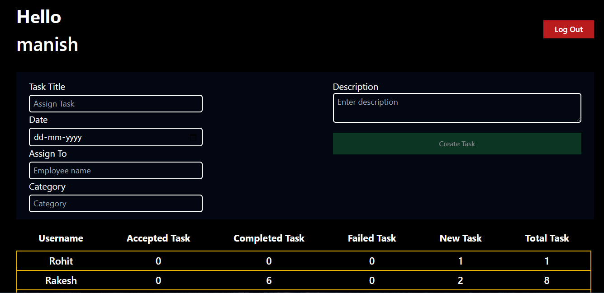
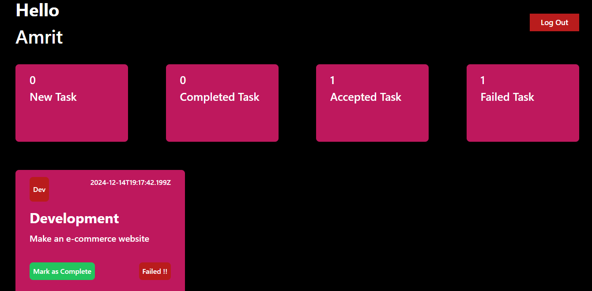

  <h1>🛠️ Task Management Web App</h1>
  
A modern and minimal task tracking system built using the MERN stack.

  

---

## 📚 Overview

A task management web application where an **Admin** can assign tasks to **Employees**, and track their progress in real time. Employees can log in, view assigned tasks, and mark them as **Completed** or **Failed**. Built for small teams, startups, and internal company use.

---

## ✨ Key Features

- 🔐 **Authentication**: Role-based login for Admin and Employees
- 🧑‍💼 **Admin Dashboard**:
  - Assign and manage tasks
  - Monitor task status (Completed / Failed / New)
  - View registered employees and progress
- 👨‍💻 **Employee Panel**:
  - View assigned tasks
  - Mark tasks as Completed or Failed
- 📊 **Task Statistics**:
  - Real-time updates on task status

---

## 🖼️ Screenshots

### 🔐 Login Page

### 🧑‍💼 Admin Dashboard

### 👨‍💻 Employee Dashboard

---

## 🧰 Tech Stack

| Technology | Description |
|------------|-------------|
| **Frontend** | React.js, Tailwind CSS *(if used)* |
| **Backend** | Node.js, Express.js |
| **Database** | MongoDB with Mongoose |
| **Authentication** | JWT (JSON Web Tokens) |
| **Hosting** | Firebase (Frontend) & Render (Backend) |

---

## 🚀 Live Demo

🔗 [Click here to open the deployed site](https://management-system-2d8df.web.app/)

---

